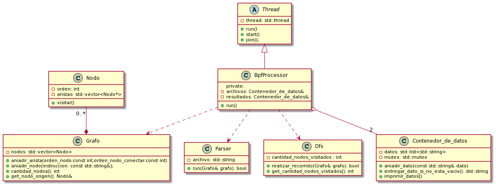

# TP2-taller

**Descripción general del trabajo realizado**  
Para el desarrollo del trabajo práctico se implementaron distintas clases con el fin de encapsular los distintos comportamientos. Se implementó la clase grafo, junto con el método de búsqueda DFS, la lógica del parseo de las instrucciones del programa, entre otras. Para cada hilo creado, en función de la cantidad de hilos pedidos por el usuario, cada hilo pide un archivo, este se parsea, se inicializa un grafo y luego un detector verifica si hay problemas con el programa procesado, mostrando por pantalla los resultados de cada hilo.

**Parseo de instrucciones**
Las instrucciones primero se leen, se agregan al grafo, y una vez hecho esto se relacionan entre sí según cada tipo de instrucción. El tipo de instrucción y la condición de etiqueta se tratan como casos separados.

**Diseño del grafo**  
El grafo se implementó como una lista de adyacencia y cada nodo contiene su orden topológico el cual se les asigna al insertarlos dentro del grafo en orden. Se utiliza el orden topológico para la búsqueda de ciclos dentro del programa. Si un nodo dentro del grafo, ya fue visitado durante el recorrido DFS y su orden topológico es mayor que uno de sus adyacentes, entonces estamos ante un ciclo.  

**Detección de ciclos e instrucciones sin usar**
Tanto para la detección de ciclos y la detección de instrucciones sin utilizar se usa el recorrido DFS. Este recorre los nodos partiendo desde el nodo origen, o sea, el nodo que se añadió primero. Se parte de este nodo ya que es la primera instrucción del programa y se sabe que por la naturaleza de los programas, la primera instrucción que se ejecuta es la primera de todo el programa. Sabiendo esto, partimos entonces de esta instrucción y dentro del recorrido de DFS se marcan como visitados los nodos que contienen instrucciones que se podrían ejecutar. Previamente se mencionó la detección de ciclos, pero para la detección de instrucciones sin utilizar solo basta con preguntarle a la clase Dfs cuantos nodos visito y comparar este numero con la cantidad de nodos en el grafo.  

**objetos compartidos**  
Se implementó una clase contenedora de datos, la cual se instancia para guardar los archivos y para guardar los resultados, debido a que no había una diferencia significativa en cuanto al comportamiento del objeto que contiene los archivos y el que contiene los resultados, y se decidió generalizar el comportamiento para poder crear la clase que sirve tanto para un objeto como para otro.  

**Diagrama de clases**  

